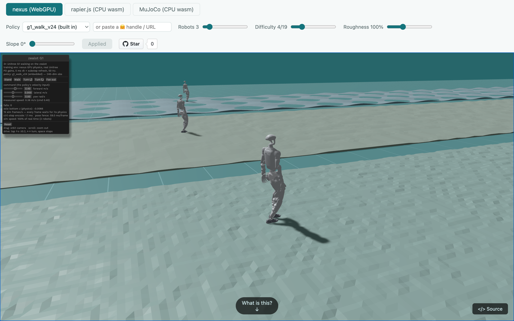

# zealot

<p align="center">
  <a href="https://haixuantao.github.io/zealot/"><b>Live demo</b></a> ·
  <a href="https://haixuantao.github.io/zealot/doc/"><b>Docs</b></a> ·
  <a href="docs/getting-started.md"><b>Getting started</b></a> ·
  <a href="docs/benchmarks.md"><b>Benchmarks</b></a> ·
  <a href="https://huggingface.co/haixuantao/zealot-g1-locomotion"><b>Policies</b></a>
</p>

A full whole-body-control training stack for humanoid robots — environment,
PPO trainer, and deployment — written entirely in Rust, on top of
[nexus](https://github.com/dimforge/nexus), dimforge's cross-platform GPU
physics engine.

[](https://haixuantao.github.io/zealot/)

## Why it's built this way

**Every layer — physics, model, training loop, deployment — is Rust,
compiled to whatever GPU is available.**

- **The simulator is Rust on any GPU.** The nexus solver is compute shaders
  written via [Rust-GPU](https://rust-gpu.github.io/); the same source runs
  through WebGPU in a browser and through CUDA or Metal natively. That is why
  the demo above can be the *actual training environment*, not an animation.
- **The learning half too.** `zealot-rl` is the rsl_rl tier rewritten in
  Rust — model, autodiff, PPO, GAE, Adam — on the same portable GPU layer
  ([vortx](https://github.com/dimforge/vortx) /
  [khal](https://github.com/dimforge/khal)) the physics uses. CPU reference
  implementations verify every GPU kernel to float epsilon.
- **One source, three compilers.** Rust-GPU → SPIR-V,
  [cuda-oxide](https://github.com/NVlabs/cuda-oxide) → PTX, naga → MSL — no
  second implementation to keep in sync. The native-CUDA path (with cuTile
  tf32 GEMMs) runs 2.4–4.3× faster than WebGPU while staying bit-exact.
- **The control loop never leaves the GPU.** Observation assembly, policy
  GEMMs, PD-target scatter, and physics substeps are one chained GPU
  workload, in training and in the browser alike.
- **Policies must survive a different solver.** The same checkpoint runs
  sim2sim on rapier.js, MuJoCo (wasm and native), Genesis, and Isaac — and on
  the physical G1 via `deploy/`.

## What's different about the physics

Derived from the solver source (full analysis with file pointers:
[docs/explanation.md](docs/explanation.md)):

| | **zealot (nexus)** | MuJoCo | Isaac Lab (PhysX 5) | MJX | Genesis |
| --- | --- | --- | --- | --- | --- |
| Articulated dynamics | generalized coords: CRBA + dense LU, on GPU | generalized coords: CRB + sparse LᵀDL (the reference) | reduced-coord articulations, Featherstone-style | MuJoCo's model via XLA | generalized coords, MuJoCo-style, in Taichi-JIT kernels |
| Constraint solver | Soft-TGS (rapier lineage) | convex smooth contact optimization | TGS | MuJoCo-like, with restrictions | MuJoCo-like convex (Newton/CG), plus coupled MPM/FEM/SPH multiphysics |
| GPU-batched envs | any GPU: WebGPU / Metal / CUDA, one source | no (CPU) | CUDA | GPU/TPU via XLA | CUDA |
| Runs in the browser | yes — the GPU sim itself, via WebGPU ([live demo](https://haixuantao.github.io/zealot/)) | yes — official wasm build, on CPU (the demo's MuJoCo tab) | no | no | no |
| Rendering | wgpu rasterizer (the browser demo) + a built-in ray tracer in the viewer (headless rollout videos) | fast OpenGL rasterizer; Madrona batch renderer in the ecosystem | Omniverse RTX — photorealistic path tracing, tiled batch cameras | via MuJoCo / Madrona | own rasterizer + photorealistic ray tracer (LuisaRender) |

The load-bearing realism claim: at Unitree's real ankle gains a G1 cannot
passively stand (MuJoCo reproduces this) — stability at 5 ms comes from the
per-substep refresh and soft-contact structure, not from inflating gains.
And the engines above aren't rivals here so much as referees: the same
checkpoint is stepped through them as sim2sim validation — see
[the sim2sim discipline](docs/explanation.md#a-policy-is-only-trustworthy-if-it-survives-a-different-solver).

## Getting started

Three steps — full walkthrough in
[docs/getting-started.md](docs/getting-started.md):

1. **Watch it walk** — the [live demo](https://haixuantao.github.io/zealot/)
   is the training env in your browser. Tap the ground, switch engines, load
   any published checkpoint.
2. **Train the humanoid** (needs
   [`cargo-gpu`](https://github.com/Rust-GPU/cargo-gpu); see
   [development.md](docs/development.md)):

   ```sh
   # RTX-class GPU: ~71 k env-steps/s at N=4096 on a 5090
   BIPED_ROBOT=g1_29dof_agile BIPED_CUTILE_GEMM=1 BIPED_TERRAIN=1 \
     cargo run --release --example biped_train_gpu \
     --features "gpu biped_gpu cutile" -- 50000 4096 my_policy.safetensors
   ```

3. **Watch *your* policy walk** — upload the checkpoint to Hugging Face and
   open `https://haixuantao.github.io/zealot/?ckpt=your-name/your-repo`.

## Documentation

[Diátaxis](https://diataxis.fr) set, hub at
[**haixuantao.github.io/zealot/doc**](https://haixuantao.github.io/zealot/doc/):

| | |
| --- | --- |
| **Getting started** | [docs/getting-started.md](docs/getting-started.md) — demo → training → your checkpoint |
| **How-to guides** | [building & development](docs/development.md) · [reproducing the benchmarks](docs/benchmarks.md) · [the demo site](website/README.md) |
| **Reference** | hosted rustdoc: [`zealot_env`](https://haixuantao.github.io/zealot/doc/zealot_env/) · [`zealot_rl`](https://haixuantao.github.io/zealot/doc/zealot_rl/) |
| **Explanation** | [docs/explanation.md](docs/explanation.md) — how it's built and why |

## Benchmarks

Historical methodology and numbers live in
[docs/benchmarks.md](docs/benchmarks.md); a clean cross-engine benchmark on
the current stack is planned before quoting headline figures here.
