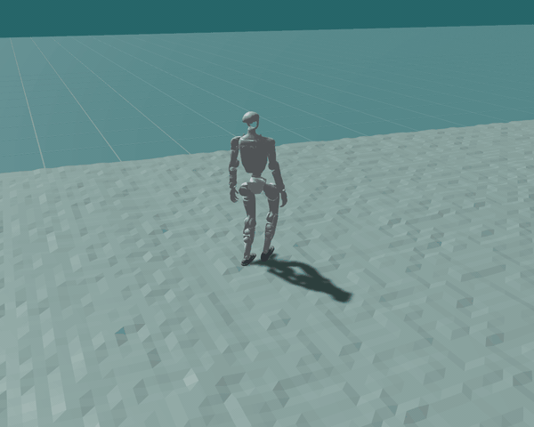

# zealot

<p align="center">
  <a href="https://haixuantao.github.io/zealot/"><b>Live demo</b></a> ·
  <a href="https://haixuantao.github.io/zealot/doc/"><b>Docs</b></a> ·
  <a href="docs/getting-started.md"><b>Getting started</b></a> ·
  <a href="docs/benchmarks.md"><b>Benchmarks</b></a> ·
  <a href="https://huggingface.co/haixuantao/zealot-g1-locomotion"><b>Policies</b></a>
</p>

A full whole-body-control training stack for humanoid robots — environment,
PPO trainer, and deployment — written entirely in Rust, on top of
[nexus](https://github.com/dimforge/nexus), dimforge's cross-platform GPU
physics engine.

[](https://haixuantao.github.io/zealot/)

## Why it's built this way

**Every layer — physics, model, training loop, deployment — is Rust,
compiled to whatever GPU is available.**

- **The learning half is Rust too.** `zealot-rl` is the rsl_rl tier
  rewritten in Rust — model, autodiff, PPO, GAE, Adam — on the same portable
  GPU layer ([vortx](https://github.com/dimforge/vortx) /
  [khal](https://github.com/dimforge/khal)) the physics uses. CPU reference
  implementations verify every GPU kernel to float epsilon.
- **One source, three compilers.** Rust-GPU → SPIR-V,
  [cuda-oxide](https://github.com/NVlabs/cuda-oxide) → PTX, naga → MSL — no
  second implementation to keep in sync; CUDA and WebGPU builds are
  bit-exact against each other, and the hot PPO GEMMs use cuTile tf32
  tensor cores.
- **The control loop never leaves the GPU.** Observation assembly, policy
  GEMMs, PD-target scatter, and physics substeps are one chained GPU
  workload, in training and in the browser alike.

The long-form version: [docs/explanation.md](docs/explanation.md).

## What's different about the physics

Derived from the solver source (full analysis with file pointers:
[docs/explanation.md](docs/explanation.md)):

| | **zealot (nexus)** | MuJoCo | Isaac (PhysX 5) | MJX | Genesis |
| --- | --- | --- | --- | --- | --- |
| Articulated dynamics | CRBA + dense LU, on GPU | CRB + sparse LᵀDL (the reference) | Featherstone articulations | MuJoCo's model, via XLA | MuJoCo-style, Quadrants-compiled |
| Constraint solver | Soft-TGS (rapier lineage) | convex optimization | TGS | MuJoCo-like, restricted | convex + MPM/FEM/SPH multiphysics |
| GPU training | CUDA · WebGPU · Metal · Vulkan | — | CUDA (multi-GPU) | GPU/TPU (multi-device) | CUDA · ROCm · Metal · Vulkan (multi-GPU) |
| Runs in the browser | ✓ the GPU sim itself ([live demo](https://haixuantao.github.io/zealot/)) | ✓ wasm build, CPU ([demo tab](https://haixuantao.github.io/zealot/?tab=mujoco)) | — | — | — |
| Ray tracing | ✓ built into the viewer | — | ✓ Omniverse RTX | — | ✓ Nyx |

## Getting started

Three steps — full walkthrough in
[docs/getting-started.md](docs/getting-started.md):

1. **Watch it walk** — the [live demo](https://haixuantao.github.io/zealot/)
   is the training env in your browser. Tap the ground, switch engines, load
   any published checkpoint.
2. **Train the humanoid** (needs
   [`cargo-gpu`](https://github.com/Rust-GPU/cargo-gpu); see
   [development.md](docs/development.md)):

   ```sh
   # RTX-class GPU: ~71 k env-steps/s at N=4096 on a 5090. The production
   # config (robot, terrain, DR, reward weights) IS the default — no env-var
   # litany; every knob remains overridable (BIPED_*).
   scripts/train.sh 50000 4096 my_policy.safetensors
   ```

3. **Watch *your* policy walk** — upload the checkpoint to Hugging Face and
   open `https://haixuantao.github.io/zealot/?ckpt=your-name/your-repo`.

## Acknowledgements

zealot stands on the shoulders of giants:

- [**WBC-AGILE**](https://github.com/nvidia-isaac/WBC-AGILE) — the
  whole-body-control velocity-tracking task, rewards, and curriculum this
  stack ports; the reference implementation our policies are benchmarked
  against.
- [**nexus**](https://github.com/dimforge/nexus) — dimforge's cross-platform
  GPU physics engine, the simulation core of the training environment.
- [**vortx**](https://github.com/dimforge/vortx) and
  [**khal**](https://github.com/dimforge/khal) — dimforge's portable GPU
  compute layer that physics and learning both run on.
- [**cuda-oxide**](https://github.com/NVlabs/cuda-oxide) — NVlabs'
  Rust-to-PTX native CUDA backend, which lets the same kernels target
  tensor-core CUDA.
- [**Rust-GPU**](https://github.com/Rust-GPU/rust-gpu) — the Rust → SPIR-V
  compiler behind the portable kernel builds.
- [**wgpu**](https://github.com/gfx-rs/wgpu) and its shader translator
  **naga** — WebGPU/Metal/Vulkan execution, including the in-browser demo.
- [**rsl_rl**](https://github.com/leggedrobotics/rsl_rl) — the PPO trainer
  design that `zealot-rl` reimplements in Rust.
- [**MuJoCo**](https://github.com/google-deepmind/mujoco) — the reference
  simulator used for sim-to-sim validation of every policy.

